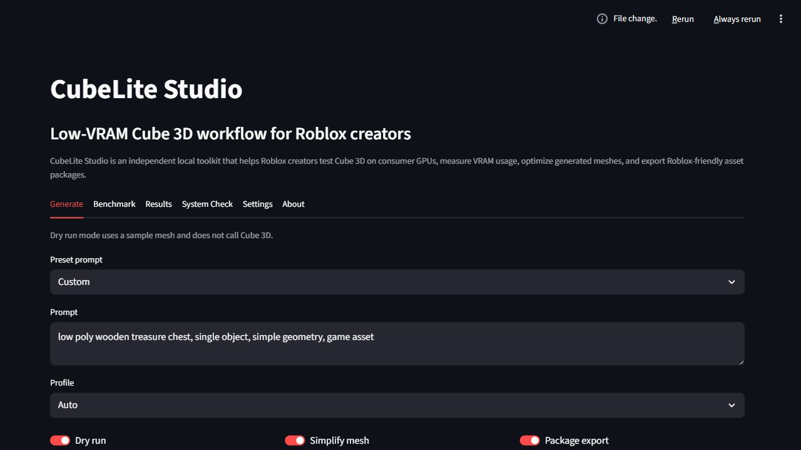

# CubeLite Studio

> Low-VRAM Cube 3D workflow and benchmarking toolkit for Roblox creators.



CubeLite Studio is an independent local toolkit that helps Roblox creators test Roblox Cube 3D on consumer GPUs, measure VRAM usage, analyze generated OBJ meshes, and export Roblox-friendly asset packages. It does not include Cube 3D model weights and is not affiliated with, sponsored by, or endorsed by Roblox Corporation.

## Why This Project Exists

Roblox Cube 3D is an open-source 3D generation model designed for text-to-shape workflows and game-engine asset generation. The official setup is aimed at higher-end GPU environments, while many everyday Roblox developers work on laptops or desktops with 6GB, 8GB, or 12GB of VRAM. CubeLite Studio explores a practical creator workflow around that gap: low-VRAM profiles, repeatable benchmarks, mesh inspection, optional simplification, and Roblox-ready export folders.

The goal is not to claim ownership of Cube 3D, retrain a foundation model, or present a fake compatibility layer. The goal is a technically honest case study: test Cube 3D on consumer hardware, identify practical bottlenecks, and make the output easier to measure and prepare for Roblox Studio.

## Key Features

- Streamlit local app for generation, benchmarks, system checks, settings, and results.
- Dry-run mode that works without Cube 3D installed.
- Low-VRAM, Balanced, High Quality, Benchmark Safe, and Auto profiles.
- GPU, CUDA, PyTorch, RAM, and dependency diagnostics.
- VRAM monitoring through PyNVML or PyTorch when available.
- OBJ mesh analysis with vertex count, triangle count, file size, scale, normals, materials, and warnings.
- Local PNG preview rendering for generated OBJ meshes.
- Heuristic Roblox-readiness report.
- Optional mesh simplification through `pymeshlab`.
- Export packages containing OBJ files, metadata, import notes, and benchmark summaries.
- Benchmark CSV, JSON, and technical Markdown report generation.

## Quick Start

```bash
python -m venv .venv
```

Windows:

```bash
.venv\Scripts\activate
```

macOS/Linux:

```bash
source .venv/bin/activate
```

Install dependencies:

```bash
pip install -r requirements.txt
```

Launch the app:

```bash
python run_app.py
```

Run a dry-run benchmark:

```bash
python run_benchmark.py --dry-run
```

## Dry Run Mode

Dry run mode uses a small valid sample OBJ mesh and does not call Cube 3D. This lets reviewers and contributors test the complete CubeLite pipeline immediately:

- prompt entry
- profile selection
- mesh analysis
- Roblox-readiness scoring
- export package creation
- benchmark CSV/JSON generation
- technical report generation

Dry-run results are useful for validating workflow behavior. They are not Cube 3D quality, speed, or VRAM measurements.

## Real Cube 3D Setup

CubeLite Studio expects users to install Cube 3D separately from official sources. In the Settings tab, set:

- local Cube 3D repo path
- local Cube 3D model weights path

CubeLite does not guess unstable Cube CLI flags. For real generation, add a `cubelite_cube_command.json` file to your local Cube 3D repo:

```json
{
  "command": ["{python}", "generate.py", "--prompt", "{prompt}", "--weights", "{weights_path}", "--output_dir", "{output_dir}"]
}
```

Only placeholders present in that template are passed to Cube 3D. Profile settings that are not supported by your Cube install remain CubeLite workflow notes or post-processing settings.

## Model Weights Note

CubeLite Studio does not download, bundle, host, or redistribute Cube 3D model weights. Download model files only from official sources and follow the original Cube 3D license.

## Low-VRAM Modes

- `Benchmark Safe`: most conservative path for minimum viable testing, using a low Cube `resolution-base`.
- `Low VRAM`: targets 6GB to 8GB VRAM workflows with preview off, simplification on, and Cube `resolution-base` set low.
- `Balanced`: targets 8GB to 12GB VRAM workflows with a midrange Cube `resolution-base`.
- `High Quality`: intended for 16GB+ GPUs; fast inference may require more VRAM and uses a higher Cube `resolution-base`.
- `Auto`: chooses a profile from detected VRAM.

These profiles are experimental workflow presets, not a guarantee that every Cube 3D release exposes every setting as a CLI flag.

## Benchmarking

The benchmark runner tests a standard prompt set across selected profiles and records:

- prompt
- profile
- success or failure
- generation time
- peak VRAM if available
- output file size
- triangle count
- readiness score
- output path
- error message

Outputs are written to `benchmarks/` as CSV and JSON.

## Roblox Export Workflow

Export packages are written to `exports/sanitized-prompt-timestamp/` and include:

- `original.obj`
- `optimized.obj` when simplification succeeds or a fallback copy exists
- `preview.png` when local rendering dependencies are available
- `metadata.json`
- `roblox_import_notes.txt`
- `benchmark_summary.json`

The readiness report is a heuristic helper, not official Roblox validation.

## Example Outputs

Use dry-run mode to create an example export package immediately. Real Cube 3D outputs require a configured Cube repo and model weights.

## Technical Report Generation

Benchmark runs can generate a Markdown report in `reports/` titled:

`CubeLite Studio: Low-VRAM Cube 3D Workflow Benchmark`

The report includes machine specs, setup notes, tested profiles, prompt set, results table, VRAM comparison notes, mesh complexity notes, limitations, and next steps.

## Known Limitations

- Real Cube 3D generation requires the user to provide Cube 3D files and model weights.
- Command-line integration depends on a user-provided command template for the specific Cube release.
- VRAM telemetry depends on PyNVML or PyTorch CUDA support.
- Mesh simplification requires optional `pymeshlab`.
- Roblox readiness is heuristic and cannot guarantee import success.
- Dry run mode validates the pipeline but does not benchmark Cube 3D itself.

## License / Attribution

CubeLite Studio is independent. It does not own Cube 3D and does not redistribute Cube 3D model weights. Users are responsible for following the original Cube 3D license and Roblox platform rules.

See [LICENSE_NOTES.md](LICENSE_NOTES.md) for practical licensing and attribution notes.

## Disclaimer

CubeLite Studio is not affiliated with, endorsed by, or sponsored by Roblox Corporation. Roblox and related marks belong to their respective owners. This project is for experimentation, benchmarking, and creator workflow support.
