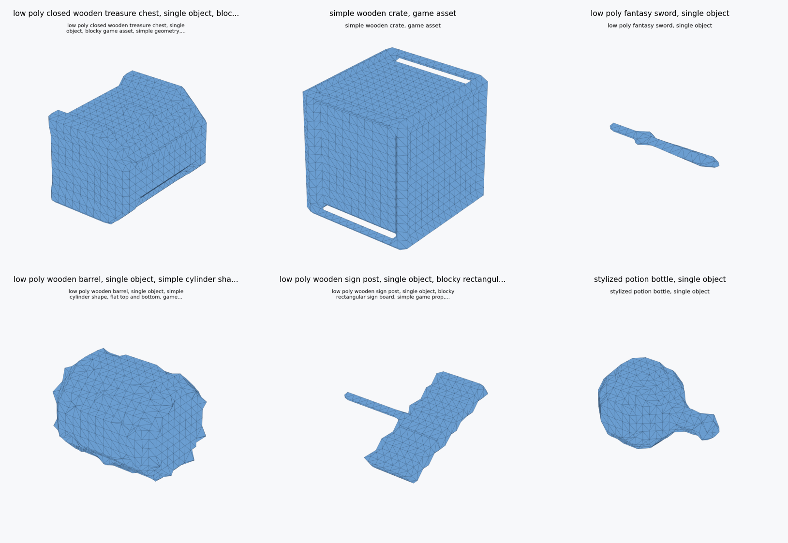

# CubeLite Studio: Roblox Cube 3D Consumer-GPU Case Study

## Executive Summary

CubeLite Studio is an independent local toolkit around Roblox Cube 3D. The project does not claim ownership of Cube 3D, does not redistribute model weights, and is not affiliated with Roblox Corporation.

The technical result is practical: on an RTX 4050 Laptop GPU with 6GB VRAM, the official high-memory path failed with CUDA out-of-memory near 5.98GB peak VRAM, while CubeLite's staged low-VRAM runner completed real Cube 3D v0.5 generations at about 4.05GB peak observed VRAM.

## Why This Is Interesting

- It turns Cube 3D experimentation into a measurable local workflow for everyday Roblox creators.
- It records actual VRAM, time, triangle count, readiness, and failure reasons.
- It exports Roblox-oriented asset folders instead of leaving users with raw model output.
- It presents honest limitations and mixed outputs instead of pretending every generation is production-ready.

## Real Local Evidence

- Real generated assets discovered: 7
- Assets with mesh/readiness data: 7
- Average generation time: 214.17 seconds
- Peak observed low-VRAM run: 4.05 GB
- Average triangle count: 1230.86
- Average readiness score: 93.14/100

Readiness is a Roblox-import heuristic, not a semantic quality score. The quality column separates showcase outputs from mixed or failed shapes.

| Prompt | Profile | Seconds | Peak VRAM GB | Triangles | Readiness | Quality | Status |
| --- | --- | --- | --- | --- | --- | --- | --- |
| low poly closed wooden treasure chest, single object, blocky game asset, simple geometry, flat lid, metal bands | Low VRAM | 210.6 | 3.93 | 1812 | 92 | Showcase | Ready to test |
| simple wooden crate, game asset | Benchmark Safe | 218.4 | 3.93 | 2856 | 92 | Showcase | Ready to test |
| low poly fantasy sword, single object | Benchmark Safe | 217.1 | 3.93 | 156 | 92 | Usable baseline | Ready to test |
| low poly wooden barrel, single object, simple cylinder shape, flat top and bottom, game prop, clean silhouette | Low VRAM | 209.7 | 4.05 | 1672 | 92 | Mixed | Ready to test |
| low poly wooden sign post, single object, blocky rectangular sign board, simple game prop, clean silhouette | Low VRAM | 209.9 | 4.05 | 680 | 92 | Mixed | Ready to test |
| stylized potion bottle, single object | Benchmark Safe | 219.2 | 3.93 | 968 | 92 | Mixed | Ready to test |
| bbox low poly medieval round shield with simple raised rim | Low VRAM BBox Test |  |  | 472 | 100 | Failure case | Ready to test |

## Low-VRAM Engineering Approach

CubeLite's experimental runner reduces peak memory by staging the pipeline:

- CLIP text encoding stays on CPU.
- The GPT token generator is loaded on GPU only for token generation.
- Classifier-free guidance is disabled in the lowest-VRAM profile.
- GPT KV cache is avoided for the lowest-VRAM profile.
- GPT and CLIP are unloaded before the shape decoder is loaded.
- Shape decoding uses `bfloat16` and a smaller chunk size.

## Product Layer

CubeLite Studio adds a creator-facing Streamlit app with Generate, Benchmark, Results, System Check, Settings, Case Study, and About tabs. It includes dry-run mode, official-path configuration, a command-template writer, local previews, export packages, benchmark CSV/JSON, and technical report generation.

## Honest Limitations

- This is not official Roblox validation.
- Generated meshes are geometry-first; material and texture workflow still needs improvement.
- Prompt quality matters, and some outputs are mixed.
- Real Cube 3D weights must come from official sources.
- Benchmarks so far are from one consumer laptop GPU and should be expanded across more hardware.

## Email-Ready Note

I built CubeLite Studio as an independent low-VRAM workflow and benchmarking layer around Roblox Cube 3D. The case study shows that on a 6GB RTX 4050 Laptop GPU, the official path hit CUDA OOM, while a staged CubeLite runner completed real Cube 3D v0.5 generations at about 4.05GB peak VRAM. The project includes a local creator app, benchmark runner, mesh/readiness analysis, export packaging, and a technical report generator designed around Roblox creator workflows.

CubeLite Studio version: 0.1.0
